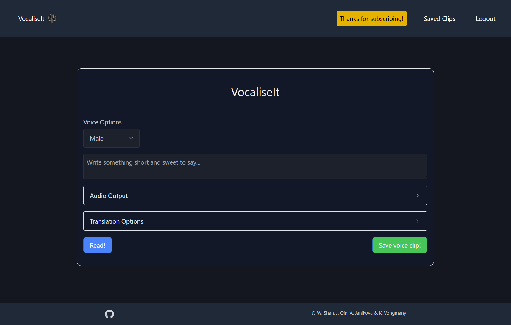
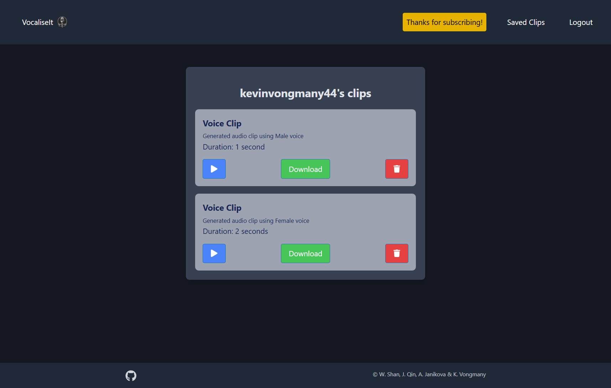

# Vocalise-It

## Description
Vocalise-It is a powerful web app that seamlessly combines text-to-speech and text-to-translate capabilities, designed to break down language barriers and improve accessibility. It has the unique feature of saving AI generated audio clips for reuse. The application has been developed using MongoDB, Express, React and Node (MERN). It employs a GraphQL, over the more traditional REST, for endpoint API servicing, as well as third party APIs such as Elevenlabs Text to Speech, Google Cloud's translate, Axios and Stripe. 


## Table of contents
  - [Installation](#installation)
  - [Usage](#usage)
  - [Contributing](#contributing)
  - [License](#license)
  
## Installation

To install the application locally, you will need to clone the repository to your local machine. You will also need to have `Node.js` & `npm` installed. 

```bash
git clone https://github.com/kevinvongmany/vocalize-it.git
```

Once you have the repository cloned, you will need to install the required dependencies and seed your data. This can be done by running the following command in the root directory of the repository:

```bash
npm install
npm run seed
``` 

You will also need to create a `.env` file in the root directory of the repository. This file should contain the following environment variables:

```bash
STRIPE_SECRET_KEY=your_stripe_secret
SERVER_API=http://localhost:3001
VITE_SERVER_API=http://localhost:3001
```

You will then need to start the server by running the following command in the root directory of the repository:

```bash
npm run start
```

  
## Usage
The application / page can be accessed at: https://vocalize-it.onreander.com

The following image shows the application's appearance and functionality:



By default the voice clip generation page is displayed. From this page you have a few options to generate an AI voice clip. Firstly you have the option to select either a male or female voice. You can then enter in the text you that you want to converted. You may also select some audio output options like the volume, the speed and pitch. Finally, you can select if you wish to have your text translated into another language. There are five to choose from English, French, German, Japanese and Arabic.

Once you made all your selections, you can click the read button to play the generated sound clip for you.

The application has a menu along the top allowing you to Login (or register). You will find this important, if you wish to save your generated voice clip. If you haven't logged on, you will be prompted to do so once you have pressed the save button.  

By clicking on Login you are then presented with a login and dialog. If you have an existing email and or password for the application, you can proceed to enter those into the fields of the login form. If you do not, then you will have to register. By selecting register, you have to enter an username, email and password. If any one of the three fields are blank, you will not be able to click on the submit button. If all three fields are correctly filled in, you can press submit and you will be both registered and logged in.

On logging on, you will be taken back to the voice clip generation page. You can enter some text and voice options to generate your voice clip (like before), but this time you will have the option to save your voice clip. If you click on save voice clip, you will be advised whether your voice was successfully saved or not. If your clip was successfully saved, you can click on Saved Clips in the navigation menu and you will be shown the voice clips (including your newly generated clip), saved against your user account. If you select the Saved Clips menu without generating anything, you will simply be advised that there are no clips to show.



On this saved clips page, and should have a least one saved clip, you have three options for each. You can either play back your clip, download your clip or delete it. Pressing delete, that clip will be removed from your list of clips. Pressing download, however, will require and an in-app subscription purchase. If you click on in it (without subscribing), you will be advised that it is for premium subscribers only. At this point, you may notice a please subscribe option in the menu bar. By clicking this, and selecting subscribe, you will be presented with a payment form (courtesy of Stripe API). By completing this page (and your payment) you will be taken back to Saved Clips page where the Please Subscribe menu item will have changed to "Thanks for subscribing". Subsequently, the ability to download your clip will be unlocked.

Once you are done with the application, you may simply click logout. Otherwise you will be automatically logged out after two hours.

### GraphQL
As this application employs a GraphQL API, use of a GraphQL API developer tool, like the Apolloserver Studio Sandox, allows one to employ any of the queries or mutations exposed by the application. These include:

Queries:  
`me: User`  - to query the logged on user   
`user(username): User`  - to query a user for a given username  
`getClip(username): User` - to query for an array of voice Clips stored against a user  
`getSubscription: SeesionId` - stripe API integration to retrieve (and set) the subscription status for a user  
`users: [User]!`  - to query all users  

Mutations:  
`createUser(username,email, password): Auth`  - creates a new user given a username, email and password  
`login(email, password): Auth` - logs in a user given an email and password  
`removeClip(clipID): User`  - removes a clip with a given id (provided you are logged on)  
`saveClip(clipInput): User`  - allows you to save a clip against the currently logged in user  
`saveAudio(audioData): FileURL` - saves the audio file into the Uploads endpoint for subsequent playback and/or download  
 

## Contributing
All code either supplied, or refactored from various sources, by the programming team of  
Jamie Qin,  
Kevin Vongmany,  
Warren Shan and  
Adrianna Janikova
  
## License
None
